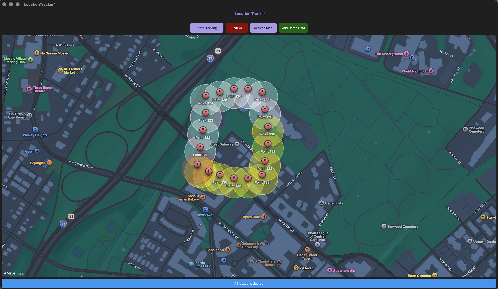

# Location Tracker App

A cross-platform location tracking application built with C# and .NET MAUI that captures GPS coordinates and visualizes them as an interactive heat map.



## 📋 Overview

This application tracks the user's geographical location at regular intervals, stores the data in a local SQLite database, and displays the locations on an interactive map with a heat map visualization. The heat map uses color gradients to show temporal information:
- **Blue (Cool)**: Oldest tracked locations
- **Yellow (Warm)**: Middle-aged tracked locations  
- **Red (Hot)**: Most recent tracked locations

## 🎯 Features

- **Real-time Location Tracking**: Captures GPS coordinates every 5 seconds
- **Persistent Storage**: Saves all location data to local SQLite database
- **Heat Map Visualization**: Color-coded circles showing location history with temporal gradient
- **Interactive Map**: Pan, zoom, and tap on location pins to see details
- **Simple Controls**:
  - Start/Stop tracking with a single button
  - Clear all saved locations
  - Refresh map to reload from database

## 🏗️ Architecture

The application follows the **MVVM (Model-View-ViewModel)** pattern:

```
LocationTracker1/
├── Models/
│   └── LocationData.cs           # Data model for location entries
├── Services/
│   ├── DatabaseService.cs        # SQLite database operations
│   └── LocationService.cs        # GPS location acquisition
├── ViewModels/
│   └── MainViewModel.cs          # Business logic and state management
├── MainPage.xaml                 # UI layout definition
├── MainPage.xaml.cs              # UI code-behind with map rendering
└── MauiProgram.cs                # App configuration and startup
```

### Key Components

#### 1. **LocationData Model**
Represents a single location point with:
- Latitude and Longitude coordinates
- Timestamp (UTC)
- GPS accuracy value
- Auto-incrementing database ID

#### 2. **DatabaseService**
Handles all SQLite operations:
- Automatic database initialization
- Async CRUD operations for location data
- Database path: `FileSystem.AppDataDirectory/locations.db3`

#### 3. **LocationService**
Manages device location access:
- Permission checking and requesting
- High-accuracy GPS readings (10-second timeout)
- Error handling for various location failures

#### 4. **MainViewModel**
Implements business logic with:
- Observable collections for data binding
- Command pattern for user actions
- Background tracking loop (5-second intervals)
- Cancellation token support for stopping tracking

#### 5. **MainPage**
Renders the UI with:
- MAUI Maps integration
- Dynamic pin creation for each location
- Heat map circles with color gradients
- Responsive button states

## 🚀 Getting Started

### Prerequisites

- **Visual Studio 2022** (17.8 or later) for Windows or Mac
- **.NET 10.0 SDK** or later
- **.NET MAUI Workload** installed
- For Windows development:
  - Windows 10 SDK (version 19041 or later)
  - Windows 11 recommended

### Installation Steps

1. **Clone or download the project**
   ```bash
   git clone <your-repository-url>
   cd LocationTracker1
   ```

2. **Open in Visual Studio**
   - Open `LocationTracker1.sln` in Visual Studio
   - Wait for NuGet packages to restore automatically

3. **Build the solution**
   - Press `Ctrl+Shift+B` (Windows) or `Cmd+B` (Mac)
   - Or: Menu → Build → Build Solution

4. **Run the application**
   - Select target platform (Windows Machine, Android Emulator, iOS Simulator)
   - Press `F5` or click the Start button
   - **Grant location permissions when prompted**

### NuGet Dependencies

The project uses the following packages (automatically restored):

```xml
- Microsoft.Maui.Controls (10.0+)
- Microsoft.Maui.Controls.Maps (10.0.11)
- sqlite-net-pcl (1.9.172)
- SQLitePCLRaw.bundle_green (2.1.11)
- Microsoft.Extensions.Logging.Debug (9.0.8)
```

## 🎮 Usage Guide

### Starting Location Tracking

1. Launch the application
2. Click **"Start Tracking"** button
3. Grant location permissions if prompted
4. The app will capture your location every 5 seconds
5. Watch the map populate with pins and colored circles
6. Status bar shows the last captured coordinates

### Stopping Tracking

1. Click **"Stop Tracking"** button
2. Status bar displays the total number of locations saved

### Clearing Data

1. Click **"Clear All"** button
2. Confirm the deletion prompt
3. All locations are removed from database and map

### Refreshing the Map

1. Click **"Refresh Map"** button
2. Reloads all locations from the database
3. Useful after app restart or data changes

## 🗺️ Heat Map Visualization

The heat map uses a temporal color gradient:

- **Oldest locations** → Blue circles (RGB: 0, 100, 255)
- **Mid-range locations** → Yellow circles (RGB: 255, 255, 0)
- **Newest locations** → Red circles (RGB: 255, 0, 0)

Each circle has:
- **Radius**: 50 meters
- **Stroke**: 60% opacity, 2px width
- **Fill**: 30% opacity

When multiple locations overlap, the transparency creates an intensity effect similar to traditional heat maps.

## 📱 Platform Support

Currently configured for:
- ✅ **Windows 10/11** (10.0.19041.0+)

Can be extended to support:
- Android (by modifying `TargetFrameworks` in `.csproj`)
- iOS (requires Mac for building)
- macOS Catalyst

## 🔒 Permissions

### Windows
Location permission is declared in `Package.appxmanifest`:
```xml
<DeviceCapability Name="location" />
```

The app requests location permission at runtime when tracking starts.

### Android (if enabled)
Add to `AndroidManifest.xml`:
```xml
<uses-permission android:name="android.permission.ACCESS_FINE_LOCATION" />
<uses-permission android:name="android.permission.ACCESS_COARSE_LOCATION" />
```

### iOS (if enabled)
Add to `Info.plist`:
```xml
<key>NSLocationWhenInUseUsageDescription</key>
<string>This app needs your location to track your movements.</string>
```

## 🛠️ Code Conventions

This project follows C# coding standards:

### Naming Conventions
- **PascalCase**: Classes, methods, properties, public members
- **camelCase**: Private fields, local variables, parameters
- **_camelCase**: Private instance fields (with underscore prefix)

### Documentation
- XML documentation comments on all public types and members
- Inline comments for complex logic
- Clear, descriptive variable and method names

### Best Practices Applied
- ✅ Async/await for all I/O operations
- ✅ Proper exception handling with specific catch blocks
- ✅ INotifyPropertyChanged for MVVM data binding
- ✅ Command pattern for UI actions
- ✅ Separation of concerns (Models, Services, ViewModels, Views)
- ✅ Dependency injection ready architecture
- ✅ Nullable reference types enabled
- ✅ Resource cleanup with CancellationTokenSource

## 📊 Database Schema

SQLite database: `locations.db3`

**Table: LocationData**

| Column    | Type     | Constraints           |
|-----------|----------|-----------------------|
| Id        | INTEGER  | PRIMARY KEY, AUTOINCREMENT |
| Latitude  | REAL     | NOT NULL              |
| Longitude | REAL     | NOT NULL              |
| Timestamp | TEXT     | NOT NULL (ISO 8601)   |
| Accuracy  | REAL     | NULLABLE              |

## 🐛 Troubleshooting

### Location Not Updating
- Ensure location services are enabled on your device
- Check that the app has location permissions granted
- Verify GPS signal strength (may not work indoors)

### Map Not Displaying
- Check internet connection (maps require data)
- Verify MAUI Maps package is installed
- Ensure platform-specific map services are configured

### Build Errors
- Clean solution: Build → Clean Solution
- Restore NuGet packages: Tools → NuGet Package Manager → Restore
- Verify .NET MAUI workload: `dotnet workload list`

### App Crashes on Startup
- Check that SQLite packages are properly installed
- Verify app has write permissions to AppDataDirectory
- Review debug logs in Output window

## 📝 Future Enhancements

Potential features to add:
- [ ] Export location data to CSV/GPX
- [ ] Filter locations by date range
- [ ] Adjustable tracking interval
- [ ] Distance and speed calculations
- [ ] Background location tracking
- [ ] Cloud synchronization
- [ ] Multiple user profiles
- [ ] Route playback animation
- [ ] Geofencing alerts

## 🤝 Contributing

When contributing to this project:

1. Follow the existing code style and conventions
2. Add XML documentation to all public members
3. Write descriptive commit messages
4. Test on multiple platforms if possible
5. Update README for new features

## 📄 License

[Specify your license here - e.g., MIT, Apache 2.0, etc.]

## 👨‍💻 Author

[Your name/organization]

## 🙏 Acknowledgments

- Built with [.NET MAUI](https://dotnet.microsoft.com/apps/maui)
- Maps powered by [MAUI Maps](https://learn.microsoft.com/dotnet/maui/user-interface/controls/map)
- Database by [SQLite](https://www.sqlite.org/)
- SQLite-net library by [praeclarum](https://github.com/praeclarum/sqlite-net)

---

**Last Updated**: December 2025  
**Version**: 1.0.0

